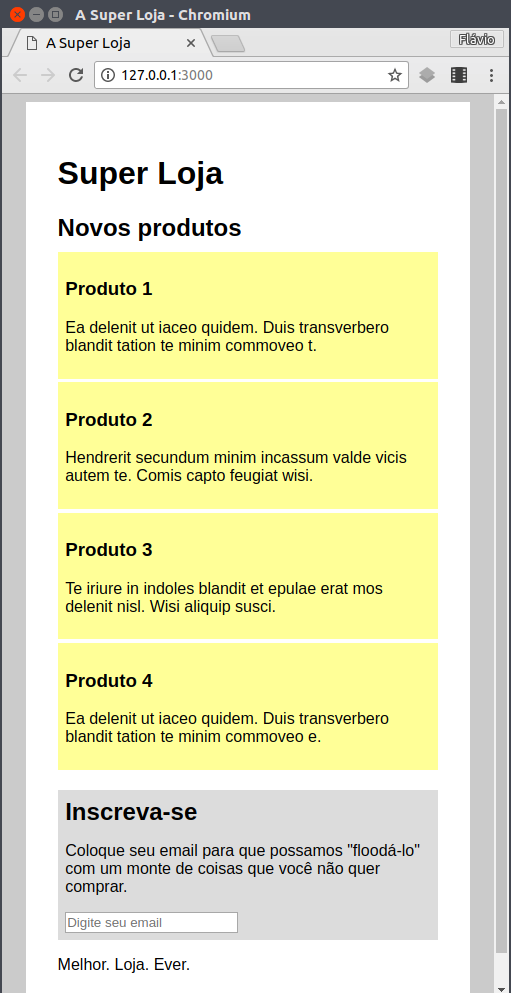

# Super Loja

Vendendo o que você não quer comprar.

## Exercício 1

Defina a janela de pintura (_viewport_) da página como tendo a mesma largura
que a largura do dispositivo (computador, celular etc.), não mais, não menos.

## Exercício 2

Até uma certa largura definida por você, em vez de colocar 2 produtos por linha,
coloque apenas 1 produto por linha, ocupando toda a largura do
`<section></section>` de produtos.

**Repare** que os produtos (`<article></article>` estão com `float: left`).

## Exercício 3

Nessa mesma largura que você definiu (no exercício 2), faça com que o
`<aside></aside>` apareça após a `<section></section>` dos produtos, mas
antes do `<footer></footer>`.

**Repare** que o `<aside></aside>` está `float: left` e o `<section></section>`
está `float: right`.

## Resultado final

